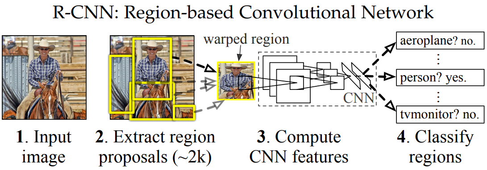
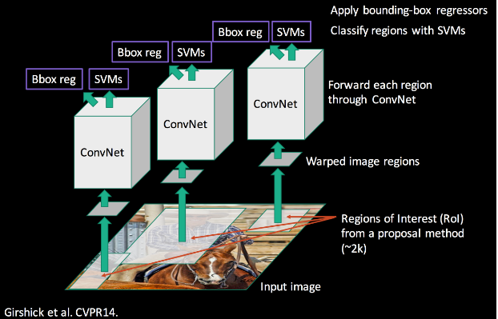
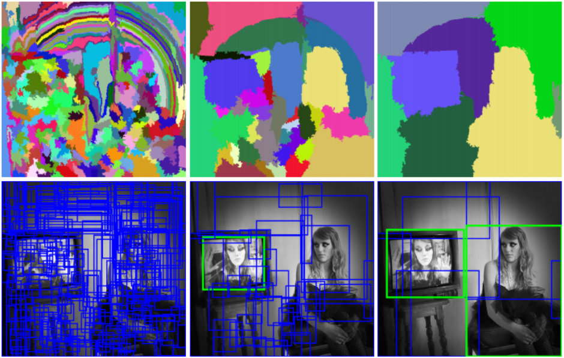
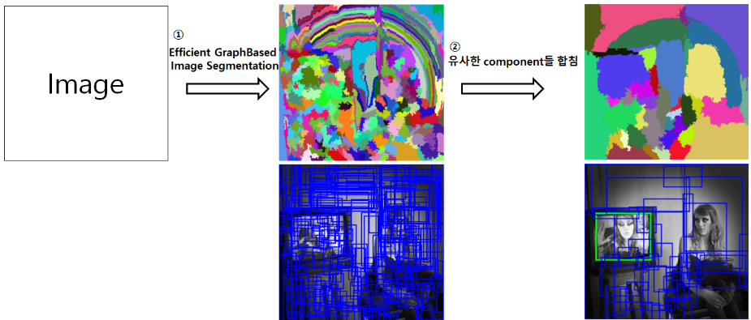
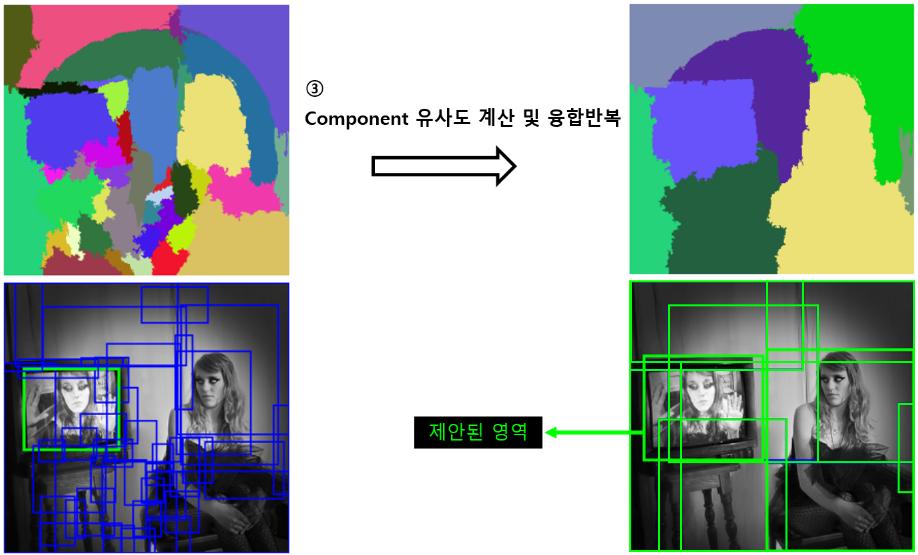
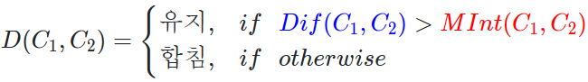
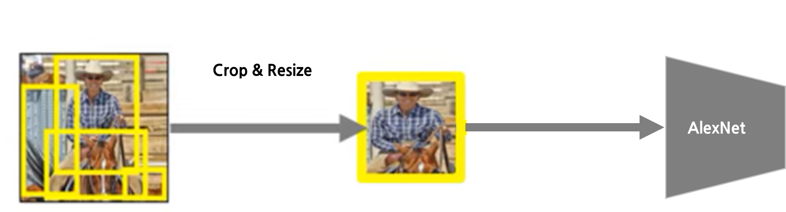
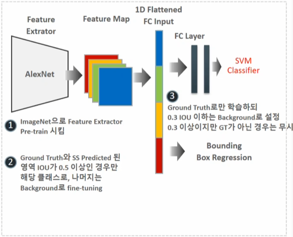
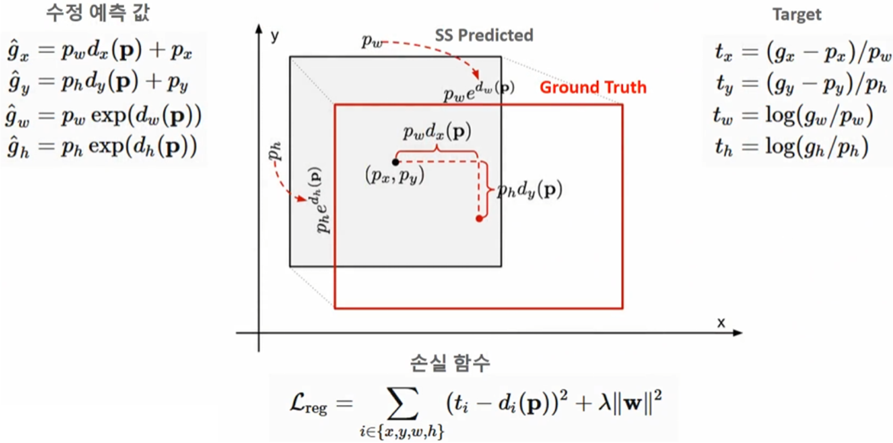
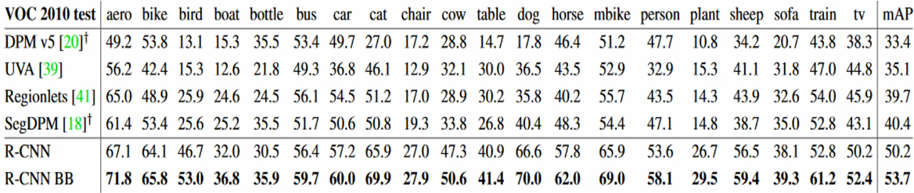

# R-CNN

---

<aside>
💡 Region-Based Convolutional Neural Networks

</aside>

## RCNN Paper

---

- **Title :** Region-based Convolutional Networks for Accurate Object Detection and Segmentation
- **Author :** Ross Girshick, Jeff Donahue, Trevor Darrell, Jitendra Malik
- **Date of Publication :** 25 May 2015

## Reasons for developing RCNN

---

- 전통적인 머신러닝의 한계를 극복하기 위한 딥러닝의 성능 활용 (CNN)
- 부족한 데이터셋의 한계 극복 (ImageNet pre-trained model fine-tuning)
- 속도와 효율성 개선 (Sliding Window → Selective Search)
- 객체 탐지의 정밀도 향상 (CNN 적용 및 Bounding box regression)

## R-CNN Overview

---

## R-CNN Flow

---

1. Input image
2. Region proposals
3. Compute CNN features
4. Classify regions

## Region Proposal

---

- Selective Search 알고리즘을 통해 bottom-up 방식으로 객체 후보 영역 제안
- R-CNN의 경우 객체 후보 영역을 2,000개로 지정

Selective Search 동작

  
  
  
  
  ① Efficient GraphBased Image Segmentation 방법을 통해 초기 영역 지정 (초기 영역: Component)
  
  ② 인접 component 유사도 판단
  
  
  
  D = Difference(외부 유사도) /  MInt = Minimum Internal Similarity(내부 유사도)
  
  ③ Component 유사도 계산 및 융합 반복

## Feature Extraction

---

- Selective Search 알고리즘을 통해 제안된 이미지들은 CNN 네크워크에 입력
- CNN 네트워크는 AlexNet 구조를 기반 (AlexNet은 ImageNet pre-train된 모델 적용)
- AlexNet에서 요구하는 이미지 사이즈는 227x227이므로 제안된 이미지들을 Warping 진행

- CNN 네트워크를 통해 추출된 Feature를 기반으로 Classification 모델과 Bounding box Regression에 사용

### Classification

---

- 학습 과정
    - Selective Search 알고리즘을 사용하여 이미지에서 객체 후보 영역 식별 후, 각 영역을 AlexNet CNN 아키텍처가 요구하는 고정 크기 (227x227)로 변환하여 CNN 입력을 통해 feature를 추출하고, feature를 기반으로 객체의 클래스를 분류하는 분류기 학습
    - 객체 클래스 분류하는 분류기는 support vector machine(SVM)
- 객체 검출
    - 테스트 단계에서, 학습된 CNN을 사용하여 테스트 이미지 후보 영역에서 특징 추출하고, 학습된 분류기를 통해 각 영역의 객체 클래스 예측.
 

Classification

### Bounding box regression

---

- 학습 과정
    - CNN에 의해 추출된 feature를 기반으로 경계 상자의 위치를 더 정확하게 조정하기 위한 회귀 모델 학습
- 객체 검출
    - 테스트 단계에서, 객체를 식별한 후, 회귀 모델을 사용하여 각 식별된 객체의 경계 상자를 더 정확한 위치로 조정.

Bounding box regression

### Result

---

### R-CNN 장단점

---

- **장점**
    - 동시대의 타 알고리즘 대비 높은 검출 정확도
- **단점**
    - 너무 느린 검출 시간과 복잡한 아키텍처 및 학습 프로세스
    - 하나의 이미지마다 Selective Search를 수행하여 2,000개의 region 영역 이미지 도출
    - 개별 이미지별 2,000개씩 생성된 regino  이미지를 CNN Feature map 생성
    - Selective search, CNN Feature extractor, SVM, Bounding box regressor로 구성되어 있는 프로세스를 거쳐 학습 및 객체 검출이 되어야함
    - 1장의 이미지를 object detection 하는데 약 50초 소요

### R-CNN 이후 Object Detection 연구 방향성

---

- Deep learning 기반 Object Detection 성능 입증
- Region Proposal 기반 성능 입증
- 검출 수행 시간 줄이고 복잡하게 분리된 개별 아키텍처를 통합 할 수 있는 방안 연구 매진
